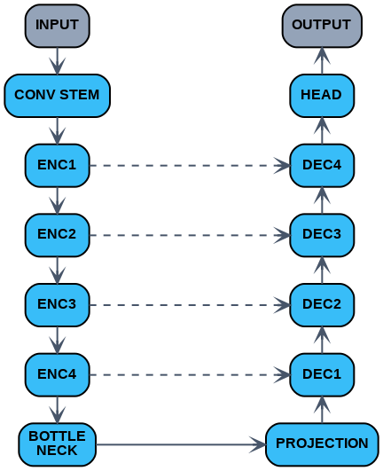
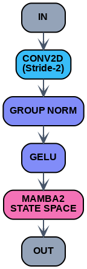
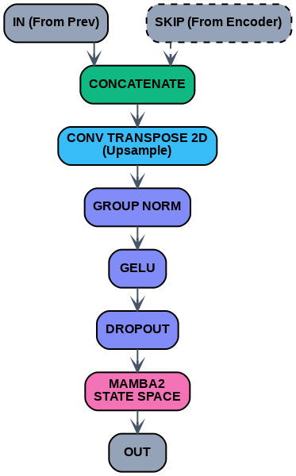

# HorizonUNet: Causal-Mamba U-Net for Extreme Precipitation Nowcasting

A spatiotemporal deep learning architecture for short-range precipitation
forecasting (t+30 and t+60 minutes) using multimodal SEVIR radar and
infrared satellite data. Built on Mamba-2 State Space Models embedded in
a hierarchical U-Net, with a physics-informed composite loss designed
specifically for extreme rainfall events.

## Overview

Standard deep learning nowcasting models face a trilemma: ConvRNNs accumulate
temporal error and smooth out high-intensity rainfall; Transformers provide
global context but require O(N^2) memory; and generative models produce sharp
outputs at the cost of high inference latency.

HorizonUNet addresses this with three design choices:

1. A Mamba2D block that runs independent horizontal and vertical SSM scans
   fused by a learnable gate, removing the 1-D directional bias of standard
   State Space Models while maintaining O(N) complexity.

2. Single-pass multi-horizon prediction (t+30 and t+60 in one forward pass),
   which eliminates autoregressive error accumulation.

3. A physics-informed composite loss with extreme-intensity up-weighting,
   spatial gradient preservation, and asymmetric heavy-rain penalties.


## Key Results (SEVIR 2018 Test Set)

| Metric         | t+30   | t+60   |
|----------------|--------|--------|
| RMSE           | 0.8291 | 0.9785 |
| CSI (heavy)    | 0.2438 | 0.2031 |
| POD (heavy)    | 0.7671 | 0.7014 |
| FSS @ 32 px    | 0.9082 | 0.8877 |
| SAL-L          | 0.0427 | 0.0563 |
| CRPS           | 0.4685 | 0.5595 |

POD_heavy temporal degradation: 8.6% (vs. 24.1% for ConvLSTM), confirming
that single-pass prediction suppresses error accumulation at longer horizons.


## Architecture

<p align="left">
  
</p>
<p align="left"><em>Fig. Model Architecture </em></p>

<p align="left">
  
</p>
<p align="left"><em>Fig. Horizon UNet Encoder </em></p>

<p align="left">
  
</p>
<p align="left"><em>Fig. Horizon UNet Decoder </em></p>

Each Mamba2DLayer runs:
- Horizontal scan: rows as sequences (B*W, H, C)
- Vertical scan:   columns as sequences (B*H, W, C)
- Learnable sigmoid gate fuses the two outputs

Total parameters: ~23 million.


## Setup

```bash
cd app/
pip install -r requirements.txt
streamlit run app.py
```

The app will look for best_model.pt in the same directory. If not found, it
runs in synthetic data demo mode so the UI can still be explored.

For GPU inference, replace the torch line in requirements.txt with the
appropriate CUDA wheel:
```
torch==2.5.1+cu121
```
available from https://download.pytorch.org/whl/cu121


### Training

```bash
cd training/
pip install -r requirements.txt
```

Install Mamba pre-built wheels matching your Python version and CUDA build.
For Python 3.12 + CUDA 12 + cxx11abi=TRUE:

```bash
pip install "https://github.com/Dao-AILab/causal-conv1d/releases/download/v1.6.0/causal_conv1d-1.6.0+cu12torch2.5cxx11abiTRUE-cp312-cp312-linux_x86_64.whl"
pip install "https://github.com/state-spaces/mamba/releases/download/v2.2.4/mamba_ssm-2.2.4+cu12torch2.5cxx11abiTRUE-cp312-cp312-linux_x86_64.whl"
```

Then edit the LOCAL_DIR path in train.py to point to your SEVIR data directory
and run:

```bash
python train.py
```

Checkpoints are saved to outputs/checkpoints/. The best checkpoint by
validation loss is saved as best_model.pt.


## Data

This project uses the SEVIR (Storm EVent ImagRy) dataset, which is publicly
available on AWS S3 at s3://sevir/.

Two modalities are used:
- VIL: Vertically Integrated Liquid (radar-derived), kg/m^2
- IR069: GOES-16 water vapor infrared channel, brightness temperature in K

To download a small set of paired event files for the demo app:

```bash
pip install s3fs
python fetch_sevir_data.py
```

This fetches 5 events (configurable via NUM_EVENTS_TO_FETCH) and saves them
to ./sample_data/ in the format expected by the app. No AWS credentials are
required (anonymous access).

The full training set uses 1000 events from 2018. Training events are stored
as paired HDF5 files:

```
<event_id>_vil.h5     -- datasets: 'past'   (13, 128, 128)
                                    'future' (12, 128, 128)
<event_id>_ir069.h5   -- same layout
```

Normalisation applied before feeding to the model:
- VIL:   (log1p(raw) - 3.5) / 1.5
- IR069: raw / 350.0


## Model Checkpoint

The trained checkpoint is not stored in this repository. To use it:

1. Download best_model.pt from the release assets of this repository, or
2. Train your own checkpoint using training/train.py.

Place best_model.pt in the app/ directory before running the Streamlit app.

The checkpoint format is:
```python
{
    'epoch':       int,
    'model_state': OrderedDict,   # state_dict compatible with HorizonUNet
    'val_loss':    float,
    'val_metrics': dict,
}
```

To load the model programmatically (inference only):
```python
from app.model_arch import load_model
model = load_model('app/best_model.pt', device='cpu')
```


## Loss Function

The composite loss optimises seven physical criteria simultaneously:

| Component             | Weight | Purpose                                      |
|-----------------------|--------|----------------------------------------------|
| Charbonnier (base)    | 1.0    | Robust L1 base, better gradient than MSE     |
| Gradient preservation | 2.0    | Preserves sharp storm cell boundaries        |
| Extreme up-weighting  | 4.0*   | Penalises errors at pixels > 93rd percentile |
| Heavy-rain asymmetry  | 3.0    | Penalises under-prediction at heavy threshold|
| Background sparsity   | 3.0    | Suppresses false alarms in clear-sky areas   |
| Area consistency      | 5.0    | Predicted vs. actual rain coverage           |
| Mean bias correction  | 10.0   | Corrects systematic domain-mean bias         |

*The extreme weight is linearly warmed up from 1.0 to 4.0 over the first 8
epochs to prevent early training instability.

Horizon weighting: t+60 is weighted at 0.6, t+30 at 0.4, to prioritise the
harder and more operationally valuable longer-range forecast.


## Evaluation Metrics

| Metric | Description                                              |
|--------|----------------------------------------------------------|
| MAE / RMSE / Bias | Pixel-wise accuracy                          |
| CSI    | Critical Success Index at light / moderate / heavy       |
| POD    | Probability of Detection                                 |
| FAR    | False Alarm Ratio                                        |
| FSS    | Fractions Skill Score at 4 / 8 / 16 / 32 pixel scales   |
| SAL    | Structure-Amplitude-Location morphological decomposition |
| CRPS   | Continuous Ranked Probability Score (MC Dropout ensemble)|

The four-fold rolling-origin cross-validation preserves chronological order
to prevent data leakage.

## License
 
MIT License. See [LICENSE](LICENSE) for details.
 
The SEVIR dataset is subject to its own terms of use. See
https://registry.opendata.aws/sevir/ for details.
